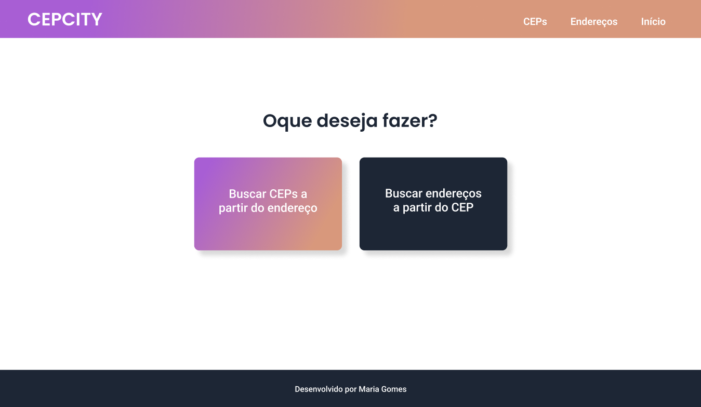

# CEPCity

É um buscador de endereços.
## Screenshots

## Objetivo

- Treinar o consumo de API e requisições GET;
- Posicionamento com Flexbox;
- Uso do Bootstrap.

## Funcionalidade

- Pesquisar endereços a partir do CEP;
- Pesquisar CEP a partir do endereço;
- Acessível em qualquer dispositivo.

## Tecnologias utilizadas
* HTML;
* CSS;
* Boostrap;
* JavaScript.
